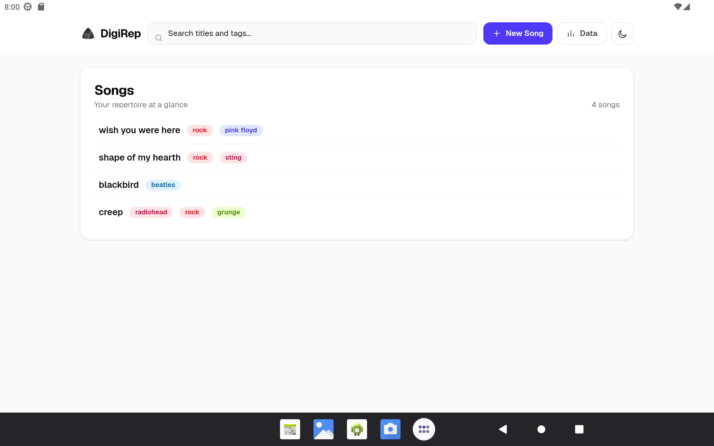
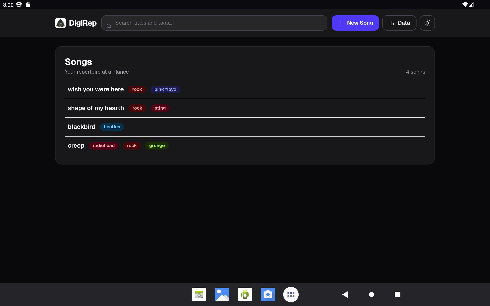
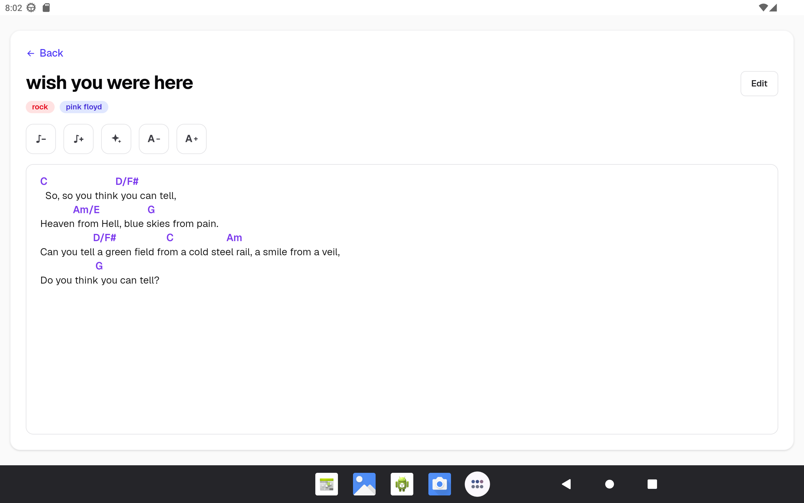
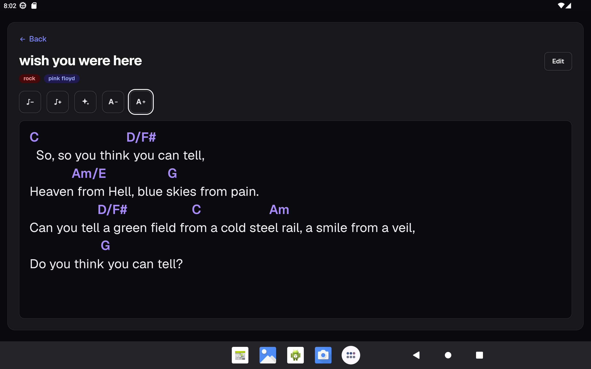
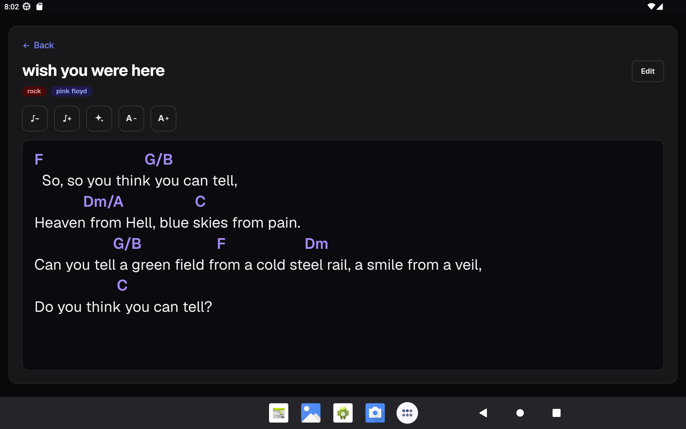

# digirepalpha

Digital repertoire manager built with Next.js, CodeMirror, and browser-local storage.

## Screenshots







## Setup

This project uses Bun `1.3.14` (see `package.json`). Install dependencies before
running the application:

```bash
bun install
```

## Development

Start the development server:

```bash
bun dev
```

Open [http://localhost:3000](http://localhost:3000).

To build and serve the static production export locally:

```bash
bun run build
bun run serve:export
```

The export is written to `out/` and served on port 3001.

## Testing

```bash
# Unit tests
bun test

# Linting
bun run lint

# TypeScript
bunx tsc --noEmit

# Install the Playwright engines used by this project once
bunx playwright install chromium webkit

# End-to-end tests, against the static production bundle on port 3001
bun run test:e2e
```

The Playwright suite builds the static export and runs independently in desktop
Chromium and WebKit. It covers search, song creation and deletion, editor
persistence, chord controls, long-press word selection, song detail editing,
routing states, theme persistence, and complete database import/export workflows.

## Android

The Android application is a Capacitor 8 wrapper around the static Next.js export. It supports Android 7 (API 24) and newer.

Requirements:

- Bun 1.3.14
- Node.js 22 or newer
- JDK 17 or newer
- Android Studio 2025.2.1 or newer
- Android SDK platform API 36 (used to compile the project)
- An Android device or emulator

The app's minimum supported Android version is API 24. The checked-in Gradle
wrapper uses Gradle 8.14.3 and the project uses Android Gradle Plugin 8.13.0.

```bash
# Build the static web bundle and copy it into the Android project
bun run android:sync

# Choose a connected device or emulator and install a debug build
bun run android:run

# Open the native project in Android Studio
bun run android:open

# Build a debug APK at android/app/build/outputs/apk/debug/
bun run android:apk
```

The Android application ID is `net.dege.digirep`; keep it stable so upgrades retain local data. Android export opens the system share sheet with a `db.songs` backup. Import uses the Android document picker.

### Android app assets

`assets/logo.svg` is the source image for the Android launcher icons and splash
screens. Generate Android assets with:

```bash
bunx capacitor-assets generate --android
```

The generated resources are written under
`android/app/src/main/res/` and are committed to the repository. Regenerate
them after changing the source logo.

If asset generation fails with a `sharp` or `libvips` error after a Bun
installation, build the native `sharp` dependency manually and retry:

```bash
cd node_modules/sharp && bun run install
```

This workaround is needed because the repository's Bun configuration skips
selected package lifecycle scripts, including `sharp`'s install step.
From the project root, retry the generator:

```bash
bunx capacitor-assets generate --android
```

### Android verification

Run the normal web checks and build a debug APK with:

```bash
bun run lint
bunx tsc --noEmit
bun test
bun run android:apk
```

## Storage

Songs are stored in the browser or app's local storage. Web and Android installations have separate local databases. Use the Data page to export a `db.songs` backup or replace the local database from a backup.
